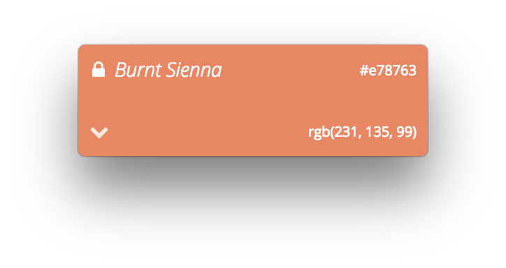

  
  <h3 align="center">ColorPeekr</h3>
  
An open-source color picker built with web technology

## Get ColorPeekr

**[Download the latest release](https://github.com/theadriann/ColorPeekr/releases)**

## Preview

  

## Features
 - Ability to lock the active color.
 - Ability to copy the color in either rgb/hex format.

## Shortcuts

-  *(Cmd/Ctrl)-Alt-1*: Locks/Unlocks peeked color.

## Thanks

- [Mobx](https://mobx.js.org/) for a really good app state management library.

